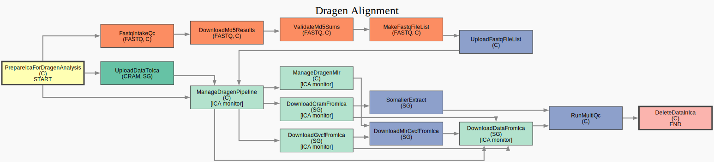

# Dragen Align PA Pipeline

## Purpose

This pipeline aligns or realigns genomic sequencing data (from FASTQ or CRAM files) using the DRAGEN pipeline on the Illumina Connected Analytics (ICA) platform.

It manages data upload to ICA, submission and monitoring of the DRAGEN pipeline, and download of results (CRAMs, gVCFs, QC metrics) back to Google Cloud Storage (GCS). It also performs subsequent QC steps, including Somalier fingerprinting and MultiQC report generation.


## Pipeline Overview

<div align="center">
    
</div>

The workflow performs the following main steps:

1.  **Prepare ICA:** Creates analysis folders within the ICA project.
2.  **Input Data Handling (Conditional):**
      * **If `reads_type = "fastq"`:**
        1.  Submits a separate pipeline in ICA to calculate MD5 checksums for all FASTQ files.
        2.  Downloads the results and validates them against a provided manifest file.
        3.  Generates a `fastq_list.csv` file for DRAGEN and uploads it to ICA.
      * **If `reads_type = "cram"`:**
        1.  Uploads the CRAM file from GCS to ICA.
3.  **Run DRAGEN:** Submits the main DRAGEN alignment pipeline to ICA and monitors its progress until completion, failure, or cancellation.
4.  **Run MLR:** Submits and monitors the DRAGEN MLR (Machine Learning Recalibration) pipeline.
5.  **Download Results:** Downloads the key outputs (CRAMs, gVCFs, and QC metrics) from ICA back to GCS.
6.  **Post-Processing QC:**
      * Runs `somalier extract` on the newly generated CRAM file to create a genomic fingerprint.
      * Aggregates all QC metrics (from DRAGEN and Somalier) into a single MultiQC report.
7.  **Cleanup (Optional, after checking all outputs are correct):** Deletes the data from the ICA platform to reduce storage costs.

## Prerequisites

1.  **Metamist Cohort:** You must have a cohort created in Metamist containing the sequencing groups you wish to process.
2.  **Configuration File:** You must create a TOML configuration file. A reference can be found at `config/dragen_align_pa_defaults.toml`.

## Configuration

Your TOML configuration file must specify the following key options:

  * `[workflow]`:

      * `input_cohorts`: A list of Metamist cohort IDs to process (e.g., `['COH0001']`).
      * `sequencing_type`: Must be set (e.g., `"genome"`).
      * `reads_type`: Critical. Must be set to either `"fastq"` or `"cram"`.
      * `last_stages`: A list of the final stages to run. To run the full pipeline including QC, use `['RunMultiQc']`. To also delete data from ICA after, use `['DeleteDataInIca']`.
      * `skip_stages`: (Optional) A list of stages to skip, e.g., `['DeleteDataInIca']`.

  * **If `reads_type = "fastq"`:**

      * `[workflow]`:
          * `manifest_gcp_path`: Must be set to the GCS path of your manifest file. This file is used to validate MD5 checksums.

  * **If `reads_type = "cram"`:**

      * `[ica.cram_references]`:
          * `old_cram_reference`: Must be set to match one of the keys in this section (e.g., `"dragmap"`). This tells the pipeline which reference genome file (already in ICA) was used to generate the *original* CRAM file.

  * `[ica.data_prep]`:

      * `upload_folder`: The folder name to create in ICA for uploading data (e.g., `"my-cram-uploads"`).
      * `output_folder`: The base folder name to create in ICA for pipeline outputs (e.g., `"my-dragen-results"`).

## How to Run the Pipeline

The pipeline is launched using `analysis-runner`.

**Example Invocation:**

```bash
analysis-runner \
--dataset <your-dataset> \
--access test \
--config <path/to/your-config.toml> \
--output-dir '' \
--description "DRAGEN alignment for <your-cohort>" \
--image "australia-southeast1-docker.pkg.dev/cpg-common/images-dev/dragen_align_pa:<image-tag>" \
dragen_align_pa
```

  * `--dataset`: The Metamist dataset associated with your cohort.
  * `--config`: The path to your local TOML configuration file.
  * `--output-dir`: This is required by `analysis-runner` but is not used by this pipeline. You can leave it as `''`.
  * `--image`: The full path to the pipeline's Docker image. The example uses a `-dev` image, but production runs will use a production (i.e. no `-dev` image)

## Pipeline Management (Important)

The `ManageDragenPipeline` stage submits a job to the separate ICA platform. The `analysis-runner` job will then wait and poll ICA for the status.

### Resuming a Monitored Run

If your `analysis-runner` job is interrupted (e.g., it fails or is stopped) while the DRAGEN pipeline is still running in ICA, you can resume monitoring.

The pipeline writes a `{sequencing_group}_pipeline_id_and_arguid.json` file to GCS upon submission.

**To resume monitoring:** Simply re-launch the pipeline with the *exact same* `analysis-runner` command. The `ManageDragenPipeline` stage will detect the existing `.json` file, read the pipeline ID from it, and begin monitoring that job instead of submitting a new one.

### Cancelling a Running ICA Pipeline

If you need to cancel a pipeline that is running in ICA:

1.  Stop the `analysis-runner` job in Hail Batch.
2.  In your TOML configuration file, set `ica.management.cancel_cohort_run = true`.
3.  Re-launch the pipeline using the same `analysis-runner` command.
4.  The `ManageDragenPipeline` stage will detect the `cancel_cohort_run` flag, read the pipeline ID from the `.json` file, and send an "abort" request to the ICA API.

## Pipeline Outputs

When successful, the pipeline downloads all results to your dataset's GCS bucket. Key outputs are organized as follows:

  * **Realigned CRAMs:**
      * `gs://{BUCKET}/ica/{DRAGEN_VERSION}/output/cram/`
  * **gVCFs:**
      * `gs://{BUCKET}/ica/{DRAGEN_VERSION}/output/base_gvcf/` (from base DRAGEN run)
      * `gs://{BUCKET}/ica/{DRAGEN_VERSION}/output/recal_gvcf/` (from MLR run)
  * **Raw QC Metrics and all Other Files:**
      * `gs://{BUCKET}/ica/{DRAGEN_VERSION}/output/dragen_metrics/`
  * **Somalier Fingerprints:**
      * `gs://{BUCKET}/ica/{DRAGEN_VERSION}/output/somalier/`
  * **Aggregated QC Report:**
      * `gs://{BUCKET}/ica/{DRAGEN_VERSION}/qc/{cohort_name}_multiqc_report.html`

---

<sub><sup>This README was generated in part by Gemini 2.5 Pro.</sup></sub>
