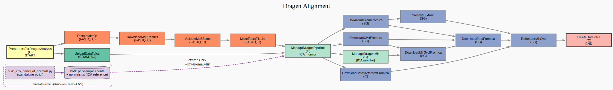

# Dragen Align PA Pipeline v4.0.0

## Purpose

Perform alignment (from fastq) or realignment (from CRAM) using Dragen v3.7.8 with ICA.
It handles both fastQ and CRAM input, and WGS and WES data.

Exome CNV uses a Panel of Normals (reference-based normalisation); WGS self-normalises.

## Pipeline Flow

<div align="center">
    
</div>

## Brief Overview

The pipeline manages preparing ICA for analysis (creating input and output locations), running and monitoring of both Dragen (alignment and variant calling) and Dragen MLR (variant recalibration). It streams the data back to GCS, generates a Somalier fingerprint for each CRAM, reheaders the MLR gVCF files (the MLR step silently drops the gVCF block info from the header), and deletes the data in ICA.

Note: One pipeline run in ICA batches 5 sequencing groups. Therefore, a cohort of `n` sequencing groups will trigger `ceil(n/5)` pipeline runs in ICA.

The workflow performs the following main steps:

1.  **Prepare ICA:** Creates analysis folders within the ICA project for Dragen output.
    - (optionally) Creates input folders for CRAM files.
2.  **Input Data Handling (Conditional):**
    - **If `reads_type = "fastq"`:**
      1.  Runs a pipeline to calculate the MD5 sums of all input fastqs
      2.  Downloads the results and validates them against the manifest file.
      3.  Generates a `fastq_list.csv` file for DRAGEN and uploads it to ICA.
    - **If `reads_type = "cram"`:**
      1.  Uploads the CRAM file from GCS to ICA.
3.  **Run DRAGEN:** Submits the main DRAGEN alignment pipeline to ICA and monitors its progress until completion, failure, or cancellation.
4.  **Run MLR:** Submits and monitors the DRAGEN MLR (Machine Learning Recalibration) pipeline.
5.  **Download Results:** Downloads the key outputs (CRAMs, gVCFs, all other VCF types, and QC metrics) from ICA back to GCS.
6.  **Run Somalier:** Runs `somalier extract` on the newly generated CRAM file to create a genomic fingerprint.
7.  **Reheader MLR gVCF:** Reheaders the MLR gVCF file to add back the gVCF block info from the original gVCF header, as the MLR tool drops it
8.  **Cleanup (Optional, after checking all outputs are correct):** Deletes the data from the ICA platform to reduce storage costs.

## Running the Pipeline

### Prerequisites

1.  **Cohort:** A cohort must exist in Metamist containing the sequencing groups you wish to process.
    - For fastQ input, there must also be a corresponding manifest file for the cohort registered in Metamist, under the `manifest` analysis type.
2.  **Configuration File:** You must create a TOML configuration file. See [Configuring the pipeline](#configuring-the-pipeline)

```bash
analysis-runner \
--dataset your-dataset \
--access test \
--config path/to/your-config.toml \
--output-dir '' \
--description "DRAGEN alignment for your-cohort" \
--image "australia-southeast1-docker.pkg.dev/cpg-common/images-dev/dragen_align_pa:image-tag" \
dragen_align_pa
```

  * `--dataset`: The Metamist dataset associated with your cohort.
  * `--access`: The access level for the pipeline run. Valid options are `test` for test datasets, and `full` for production datasets. `standard` breaks GCS upload.
  * `--config`: The path to your local TOML configuration file.
  * `--output-dir`: This is required by `analysis-runner` but is not used by this pipeline. You can leave it as `''`.
  * `--description`: A description for the pipeline run.
  * `--image`: The full path to the pipeline's Docker image. The example uses a `-dev` image, but production runs will use a production (i.e. `images`, not `images-dev`)


## Configuring the pipeline
The default [`config file`](config/dragen_align_pa_defaults.toml) should be used as a base to configure the cohort that you are running.

Config files should be reviewed and merged into the `production-pipelines-configuration` repository prior to running on production data. You can also find the values for config settings such as `ica.projects.dragen_align` in the config files in this repository.
Valid entries for config settings such as `dragen_align_pa.manage_dragen_pipeline.presets.exome.bed_names` can be found in [`constants.py`](src/dragen_align_pa/constants.py).

### Sections that must be edited

Your TOML configuration file must specify the following key options:

  * `[workflow]`:

      * `input_cohorts`: A cohort ID to process, in list format (e.g., `['COH0001']`).
      * `sequencing_type`: One of `genome` or `exome`
      * `reads_type`: Must be either `cram` for realigning existing data, or `fastq` for aligning new data.
      * `last_stages`: The last stage in the workflow that you want to run.
          * To run everything except deleting ICA data, use `['ReheaderMlrGvcf']`.
          * To run everything including deleting ICA data, use `['DeleteDataInIca']`.

   * **If `reads_type = "cram"`:**

      * `[ica.cram_references]`:
          * `reference`: Must be set to one of the defined references in [`constants.py`](src/dragen_align_pa/constants.py). Current valid options are `hg38_masked.fasta` and `hg38_unmasked.fasta` e.g. `reference = 'hg38_masked.fasta'`.
   * **If `reads_type = "fastq"`:**
      * `[manifest]`: Check that the values in the config match the values in the manifest. Even a single mismatch (e.g. `filenames` vs `Filenames`) will cause a pipeline crash.
   * `[ica.projects]`: Set these to valid entries. Examples can be found in the `production-pipelines-configuration` repository. `fastq_source_project_id` is only needed if `reads_type = 'fastq'`.
   * `[ica.management]`:
      * `monitor_previous`: Set to `false` for new runs, set to `true` if the pipeline in GCS crashes, but the pipelines in ICA are still running fine.
      * `force_resubmit`: This should almost always be set to `false`. Set to `true` if you encounter an unrecoverable desync between the state recorded in GCS and ICA. This will overwrite the state files in GCS, and force the ICA pipeline to run again, even if it had completed successfully.
  * `[ica.tags]`: Set these to sensible values. It is recommended to set reads type and sequencing type in the technical tags, project name in the user tags, correct reference in the reference tags at a minimum.
  * `[dragen_align_pa.manage_dragen_pipeline.presets.exome.bed_names]`: Set these to the names of the BED files to use for exome alignment. These must match the name(s) of BED files defined in [`constants.py`](src/dragen_align_pa/constants.py).
  * `[ica.data_prep]`:
      * `upload_folder`: The folder name to create in ICA for uploading data (e.g., `"my-cram-uploads"`).
      * `output_folder`: The base folder name to create in ICA for pipeline outputs (e.g., `"my-dragen-results"`).


## Pipeline Management

Both `ManageDragenPipeline` and `ManageDragenMlr` stages submit a job to ICA and then poll for status. All other stages run in GCS.

### Resuming a Monitored Run

If either of the `Manage` stages crash, you can resume monitoring. The pipeline writes a state file ([example](docs/example_cohort_batches.json)) that records all the inputs, ICA pipeline ID, ar-guid, retry status, and other metadata. Resuming monitoring is as simple as setting `ica.management.monitor_previous = true` in the configuration file and resubmitting the pipeline with the same `analysis-runner` command. It will detect the existing state file and resume monitoring from there.

### Cancelling a Running ICA Pipeline

If you need to cancel a pipeline that is running in ICA:

1.  Cancel the `analysis-runner` job in Hail Batch.
2.  In your TOML configuration file, set `ica.management.cancel_cohort_run = true`.
3.  Re-launch the pipeline using the same `analysis-runner` command.
4.  Both `Manage` stages will detect the `cancel_cohort_run` flag, read the pipeline ID from the state file, and send an "abort" request to the ICA API.
5.  It will then delete all of the state files in GCS, so that you don't hit an error `The pipeline has been cancelled` when resubmitting.

This sequence avoids the need of cancelling hundreds of pipeline runs in ICA manually.

## Pipeline Outputs

When successful, the pipeline downloads all results to your dataset's GCS bucket. Key outputs are organized as follows:

  * **Realigned CRAMs:**
      * `gs://{BUCKET}/ica/{DRAGEN_VERSION}/output/cram/`
  * **gVCFs:**
      * `gs://{BUCKET}/ica/{DRAGEN_VERSION}/output/base_gvcf/` (from base DRAGEN run)
      * `gs://{BUCKET}/ica/{DRAGEN_VERSION}/output/recal_gvcf/` (from MLR run)
  * **Raw QC Metrics and all Other Files:**
      * `gs://{BUCKET}/ica/{DRAGEN_VERSION}/output/dragen_metrics/`
  * **Somalier Fingerprints:**
      * `gs://{BUCKET}/ica/{DRAGEN_VERSION}/output/somalier/`
  * **Pipeline Batch Metrics:**
      * `gs://{BUCKET}/ica/{DRAGEN_VERSION}/output/dragen_batch_metrics/`

## Panel of Normals (Exome CNV)
**Generation**
- The standalone `scripts/build_cnv_panel_of_normals.py` 
    * Because of how illumina designed the ICA DRAGEN pipeline, we need to push the samples we have chosen to use as the PON through the pipeline once to generate the exome targets counts files. 
    * This script takes a list of sequencing groups (all from one library prep/capture technology) and preserves their GC-corrected target counts TSV files in a user provided GCS path. 
    * ICA DRAGEN (sensibly!) detects if a sample you want to call CNVs on is also in the PON, leading to the run being aborted (`caseSampleNotInPoN` error). To avoid this, we modify the sample names in the PON files by appending a user-defined suffix (defaults to `_pon`) to the sequencing group IDs in the file names and upload them to an ICA reference folder. The script then writes these ICA paths to a `normals.txt` file in the same reference folder. 
    * Once finished it emits the ICA file IDs.
**Usage** 
- Wiring a panel into a run config:
    * `user.additional_file_ids` (raw `fil.…` IDs) + `--cnv-normals-list` via `user.additional_args`; the exome preset already runs `--cnv-enable-self-normalization` false.


## FASTQ Manifest File Structure

In fastq mode, the pipeline expects a manifest file that contains at least the following columns: `sample_id, filenames, checksum, lane, machine_id, flowcell, cpg_sequencing_group_id`
The `cpg_sequencing_group_id` is the key used to join the manifest data to the sequencing groups in the cohort.

##### An example of the required manifest CSV structure showing only required columns
| sample_id | filenames | checksum | lane | machine_id | flowcell | cpg_sequencing_group_id |
| :--- | :--- | :--- | :--- | :--- | :--- | :--- |
| 0001 | 0001_R1.fastq.gz | d41d8cd98f00b204e9800998ecf8427e | 1 | M0001 | AABBCC | ID0001 |
| 0001 | 0001_R2.fastq.gz | 9800998ecf8427e1d8cd98f00b204e98 | 1 | M0001 | AABBCC | ID0001 |
| 0002 | 0002_R1.fastq.gz | 1234567890abcdef1234567890abcdef | 1 | M0001 | AABBCC | ID0002 |
| 0002 | 0002_R2.fastq.gz | fedcba0987654321fedcba0987654321 | 1 | M0001 | AABBCC | ID0002 |
